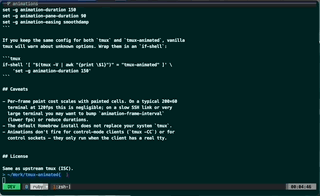

# tmux-animated



A patch on top of upstream tmux that adds smooth animations for
window switches, pane splits, resizes, and closes.

## What it animates

- **Window switching** — the two windows' pane contents slide; the
  active-window highlight in the status bar slides to its new tab.
  In-flight retargeting: mash `next-window` repeatedly and the slide
  rebases continuously instead of queueing.
- **Pane resize** — borders smooth-move from old to new position.
- **Pane split** — the new pane grows from zero into its final bounds.
- **Pane close** — the dying pane shrinks toward its centre while
  neighbours expand into the space. Works for `kill-pane` AND for
  shell exits (e.g. `Ctrl-D`).

## Install

### Homebrew (macOS / Linuxbrew)

```bash
brew tap jonaburg/tmux-animated
brew install tmux-animated
```

Installs as `tmux-animated`, leaving any existing `tmux` binary in
place. Run `tmux-animated` instead of `tmux`, or alias it.

### One-shot install script

```bash
curl -fsSL https://raw.githubusercontent.com/jonaburg/tmux-animated/animations/install.sh | bash
```

Clones tmux at the tracked upstream version, applies the patch, builds,
and installs to `/usr/local/bin/tmux-animated`. Requires `cc`,
`autoconf`, `automake`, `pkg-config`, `libevent`, `ncurses`.

### Apply the patch to your own tmux build

```bash
git clone https://github.com/tmux/tmux.git
cd tmux
git checkout <commit-the-patch-was-made-against>
curl -fsSL https://raw.githubusercontent.com/jonaburg/tmux-animated/animations/patches/tmux-animated-next-3.7.patch | patch -p1
./autogen.sh && ./configure && make
```

The patch in `patches/` should be regenerated against each upstream tmux
release; the filename indicates which.

### Build from source

```bash
git clone -b animations https://github.com/jonaburg/tmux-animated.git
cd tmux-animated
./autogen.sh && ./configure && make
sudo make install
```

## Configure

These session options control behaviour:

| Option | Default | Meaning |
|---|---|---|
| `animation-enable` | `on` | Master switch. Off disables all animations. |
| `animation-window-switch` | `slide` | `slide` or `off`. |
| `animation-pane-layout` | `on` | Animate split / close. |
| `animation-pane-borders` | `on` | Draw pane borders during pane layout animations. |
| `animation-alt-screen` | `on` | Animate programs entering / leaving the alternate screen (vim, htop, less, ...). |
| `animation-duration` | `120` | Window slide duration (ms). |
| `animation-pane-duration` | `80` | Pane animation duration (ms). |
| `animation-easing` | `smoothdamp` | `smoothdamp`, `linear`, or `ease-in-out`. |
| `animation-tau` | `40` | Smoothdamp time constant (ms). |
| `animation-frame-interval` | `8` | Target frame interval (ms). |
| `animation-status-highlight` | `on` | Animate the active-window tab highlight. |

Example `~/.tmux.conf`:

```tmux
set -g animation-duration 150
set -g animation-pane-duration 150
set -g animation-easing smoothdamp
```

If you keep the same config for both `tmux` and `tmux-animated`, vanilla
tmux will warn about unknown options. Wrap them in an `if-shell`:

```tmux
if-shell '[ "$(tmux -V | awk "{print \$1}")" = "tmux-animated" ]' \
    'set -g animation-duration 150'
```

## Caveats

- Per-frame paint cost scales with painted cells. On a typical 200×60
  terminal at 120fps this is negligible; on a slow SSH link or very
  large terminal you may want to bump `animation-frame-interval`
  (lower fps) or reduce durations.
- The default Homebrew install does not replace your system `tmux`.
- Animations don't fire for control-mode clients (`tmux -CC`) or for
  control sockets — they only run when the client has a real tty.


## License

Same as upstream tmux (ISC).
